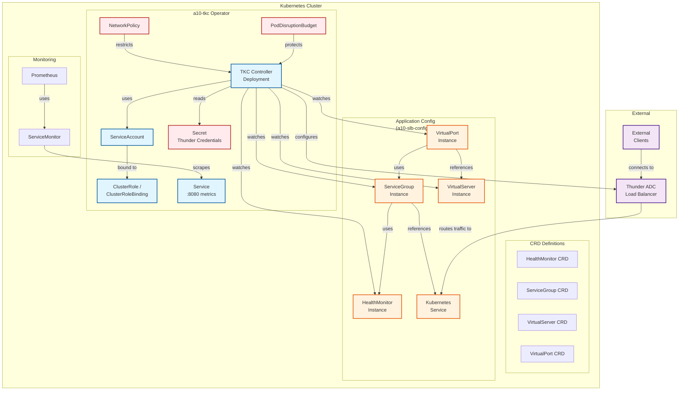

## Architecture Overview

### Components

**TKC Operator (a10-tkc chart)**
- Watches CRD instances
- Reconciles state with Thunder ADC
- Runs with leader election
- Exports metrics on :8080

**Configuration Resources (a10-slb-config chart)**
- HealthMonitor: Health check configuration
- ServiceGroup: Backend pool + LB method
- VirtualServer: Frontend VIP
- VirtualPort: Port + protocol binding

**Security**
- NetworkPolicy: Egress only to Thunder + K8s API
- RBAC: Limited to specific resources
- PodSecurityContext: Non-root, read-only FS
- Secret: Thunder credentials (stringData)

### Traffic Flow

1. Client → Thunder ADC (VIP)
2. Thunder ADC → Kubernetes Service (NodePort/ClusterIP)
3. Service → Application Pods

### Control Flow

1. User deploys HealthMonitor, ServiceGroup, VirtualServer, VirtualPort CRDs
2. TKC watches for changes
3. TKC reconciles with Thunder ADC via AXAPI
4. Thunder ADC configures SLB objects
5. Status updated on CRD instances

### High Availability

- **TKC**: Leader election (only one active reconciler)
- **Thunder ADC**: Supports HA pairs (future enhancement)
- **PodDisruptionBudget**: Ensures availability during cluster operations
